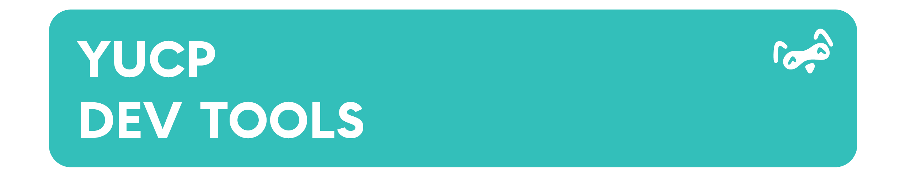

# YUCP DevTools

Development tools for YUCP package creators and avatar variant management.



## 🚀 Features

### Package Exporter
- **Profile-Based Export System** - Save and reuse export configurations
- **Assembly Obfuscation** - Automatic ConfuserEx integration with customizable presets
- **Custom Package Icons** - Inject custom icons into .unitypackage files
- **Dependency Scanner** - Auto-detect VPM and Unity package dependencies
- **Ignore System** - .yucpignore files for excluding folders/files
- **Export Inspector** - Preview all assets before exporting

### Model Revision Manager (Beta)
- **Variant Management** - Manage multiple avatar versions from a single base
- **Blendshape Transfer** - Automatically transfer blendshapes between model revisions
- **Bone Mapping** - Intelligent bone path resolution across variants
- **Override System** - Per-variant material, mesh, and component overrides
- **VRCFury Integration** - Build-time processing with VRCFury actions
- **Visual Inspector** - Tree view of all variants and their configurations

## 📦 Installation

### Via VCC (Recommended)

Add this VPM repository to your VRChat Creator Companion:
```
https://dev.vpm.yucp.club/index.json
```

Then install "YUCP DevTools" from the package list in your project.

### Manual Installation

1. Download the latest `.unitypackage` from [Releases](https://github.com/Yeusepe/YUCP-Dev-Tools/releases)
2. Import into your Unity project
3. Install [YUCP Components](https://vpm.yucp.club) as a dependency

## 🔧 Usage

### Package Exporter

1. Open from menu: `Tools > YUCP > Package Exporter`
2. Create an Export Profile: `Assets > Create > YUCP > Export Profile`
3. Configure folders, assemblies, and dependencies
4. Click "Export Package" to build your .unitypackage
5. Optional: Enable obfuscation and custom icons

### Model Revision Manager

1. Create a ModelRevisionBase: `Assets > Create > YUCP > Model Revision Base`
2. Add ModelRevisionVariant component to your avatar variants
3. Open manager: `Tools > YUCP > Model Revision Manager`
4. Configure blendshape mappings and bone transfers
5. Build your avatar - transfers process automatically at build time

## 📋 Requirements

- Unity 2022.3 or later
- [YUCP Components](https://vpm.yucp.club) >= 0.2.9
- VRChat SDK3 Avatars (automatically installed via VPM)
- VRCFury (automatically installed via YUCP Components)

## 📚 Documentation

- **Package Documentation**: See [Packages/com.yucp-devtools/README.md](Packages/com.yucp-devtools/README.md)
- **Package Exporter Guide**: See [Editor/PackageExporter/Templates/README_Template.md](Packages/com.yucp-devtools/Editor/PackageExporter/Templates/README_Template.md)
- **YUCP Components**: https://github.com/Yeusepe/YUCP-Components

## 🤝 Support

- **Issues**: [GitHub Issues](https://github.com/Yeusepe/YUCP-Dev-Tools/issues)
- **Main Package**: [YUCP Components](https://github.com/Yeusepe/YUCP-Components)
- **VPM Listing**: https://dev.vpm.yucp.club

## 📄 License

MIT License - See [LICENSE.md](Packages/com.yucp-devtools/LICENSE.md)

## 🏗️ Development

This repository uses GitHub Actions for automated package building and VPM listing generation.

### Repository Structure
```
YUCP-Dev-Tools/
├── Packages/
│   └── com.yucp-devtools/          # Main package
├── Website/                         # VPM listing website
│   ├── index.html
│   ├── source.json
│   └── ...
└── README.md
```

### Building Releases

Releases are automatically built via GitHub Actions when you:
1. Update the version in `Packages/com.yucp-devtools/package.json`
2. Run the "Build Release" action

The listing at https://dev.vpm.yucp.club is automatically updated on each release.

---

**Made with ❤️ by YUCP Club**
